# example-qldb-ledger-migration

This project demonstrates a data migration from Amazon Quantum Ledger Database (QLDB) to Amazon Aurora PostgreSQL using the vehicle registration (DMV) ledger from the  [tutorial](https://docs.aws.amazon.com/qldb/latest/developerguide/getting-started.html) in the [Amazon QLDB Developer Guide](https://docs.aws.amazon.com/qldb/latest/developerguide/what-is.html) as an example.

## Migration Decisions

When performing a database migration, you must decide what data will be migrated.  For some applications, migrating the entire database with all historical data is desired.  For others, migrating only recent data—perhaps the last 12 months, for example—and archiving older data is the best choice.  Still, others may decide to migrate recent data to accelerate application cutover, migrating older data to the new database later.  Finally, few migrations today are performed all at once, requiring the target database to be kept up-to-date with the source database for a period of time until cutover.  

This solution performs a base migration of the entire ledger as of the moment the ledger export was requested and streams on-going ledger changes into Aurora PostgreSQL from that moment until the stream is shut-down at cutover.

You must also decide how to model the data in the target database and transform the ledger data to fit that model during migration.  QLDB is a document database that does not enforce the structure of data.  The structure of data in the ledger may change over time and older revisions of a document in history may have a different structure than its current version in its table.  Documents in a table don’t all need to conform to a common structure, allowing tables to act more as namespaces or collections instead of items of the same clearly-defined type.  All of these reasons make it challenging to migrate the ledger to a relational database.  You may choose to migrate the data into Aurora PostgreSQL as JSON which greatly simplifies the migration, but it may not be the most efficient option depending on how you’ll access your data in the relational database.  The alternative is to normalize the ledger data during migration, converting the document model to a relational model and accounting for any changes to the document model that occurred over time.  This approach is more complex, requires more coding, and is prone to unexpected conversion errors that disrupt the migration process, but it may be a better choice, depending on how the data is accessed and used in the RDBMS.

In this solution, we demonstrate both approaches.  The ledger data from the vehicle registration sample app is normalized into a relational model, but the revision metadata from the ledger is stored in Aurora PostgreSQL as a JSONB type.

## Solution Architecture

The migration is performed in two phases:  full load and on-going replication.  The full load performs an efficient bulk load of data from the source database into the target database.  The source database may continue serving traffic until the application cuts over to use the target database, so it may contain data changes that were not migrated by the full load.  The on-going replication phase continually captures changes and migrates them to the target database, keeping it up-to-date with the source until the application is pointed to the target database.

In the full-load phase, the QLDB ledger is exported into an Amazon S3 bucket by a Step Function.  The export contains data from all transactions as of the moment the export was initiated.  An AWS Glue job extracts the ledger document revisions from the exported files and transforms them into a comma-separated values (CSV) format that AWS Database Migration Service (DMS) can use.  The Glue job writes the transformed CSV files to S3.  A DMS task reads the CSV files from S3 and loads their data into an Aurora PostgreSQL database.  Although this project migrates data into Aurora PostgreSQL, DMS supports a variety of target endpoints, so the process demonstrated here can be easily adapted to migrate to other databases.

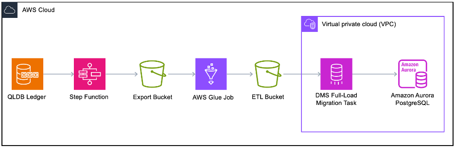

The on-going replication phase captures new updates to the ledger and migrates them to the target Aurora PostgreSQL database in near real-time.  The process relies on QLDB’s streaming feature.  The solution identifies the last ledger block in the export so that the stream can begin with the first block committed after the export began.  As new transactions are committed to the ledger, QLDB sends those changes into a Kinesis Data Stream. A Lambda function consumes the events from the Kinesis stream and writes their data to the target database.

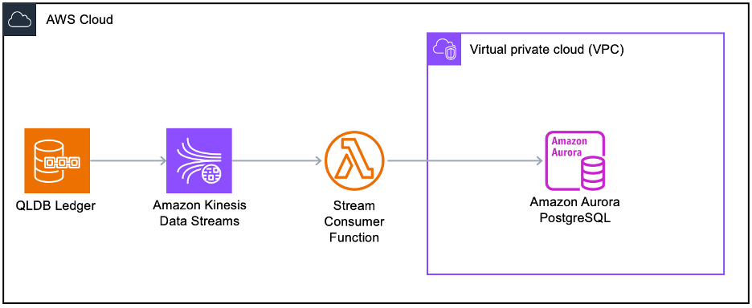

## Setup & Execution

All of the components of this solution are deployed using AWS CloudFormation.  The project contains the following files:

|Filename|Description|
|---|---|
|setup.yml|Deploys and populates the vehicle-registration ledger, the target Aurora PostgreSQL database, and related VPC networking.|
|ledger-export.yml|Deploys components to export data from the ledger.|
|ledger-full-migration.yml|Deploys the AWS Glue and Database Migration Service components to extract, transform, and load the exported ledger data into the target database.|
|ledger-cdc-migration.yml|Sets up the Kinesis data stream for QLDB streaming and the stream consumer that writes ledger changes to the target database.|
|dmv-postload-ddl.sql|Contains SQL statements to create indexes in the target database after the full-load phase of the migration is completed.|

### Create the Source and Target Databases

First, we'll create a QLDB ledger to act as our source and an Aurora PostgreSQL cluster to act as our target, along with a VPC and related networking, Secrets Manager secrets to hold database credentials, S3 buckets, IAM roles, and other components required to launch an Aurora cluster.  The setup populates the ledger database with data, creates the database and schema on the Aurora PostgreSQL cluster, and creates a database user for the migration. 

Create a new CloudFormation stack called "ledger-migrate-setup" using the setup.yml file from the project files.  The template has several parameters that can be left at their defaults unless they conflict with existing objects in your account.

|Parameter|Value|
|---|---|
|**VPCName**|dmv-migrate|
|**VPCCIDR**|10.10.0.0/16|
|**PublicSubnetCIDRs**|10.10.1.0/24, 10.10.11.0/24, 10.10.21.0/24|
|**DatabaseSubnetCIDRs**|10.10.2.0/24, 10.10.12.0/24, 10.10.22.0/24|
|**LedgerName**|vehicle-registration|
|**AuroraDatabaseName**|ledger|
|**AuroraDBInstanceClass**|db.r7g.large|

Launch the stack and wait for it to complete before proceeding.

### Export Data From QLDB

The next step in the migration is to export data from the source ledger into an Amazon S3 bucket.  The export is composed of many files, each file containing one or more ledger blocks in JSON format (see [Export output](https://docs.aws.amazon.com/qldb/latest/developerguide/export-journal.output.html) for details).  Exporting even a medium-sized ledger may take several hours.  To reduce the export time, multiple exports of a single ledger can run in parallel, each export processing a portion of the ledger.  QLDB supports up to 2 concurrent exports by default.  Customers with very large ledgers (hundreds of gigabytes) can contact AWS Support to request that limit to be increased.

We use an AWS Step Function to perform the export.  The step function accepts the desired number of concurrent exports as a parameter.  It fetches a ledger digest to obtain the last block number in the journal and uses that to divide the ledger into equal parts, dividing work evenly across exports.  The step function starts the export jobs and loops until they are all complete.

Create a new CloudFormation stack called "ledger-export" using the ledger-export.yml file from the project files.  This stack does not have any parameters.  Launch the stack and wait for it to complete before proceeding.

When the stack is in the CREATE_COMPLETE stage, navigate to the AWS Step Functions console.  In the list of state machines, click the “LedgerExporter” state machine.

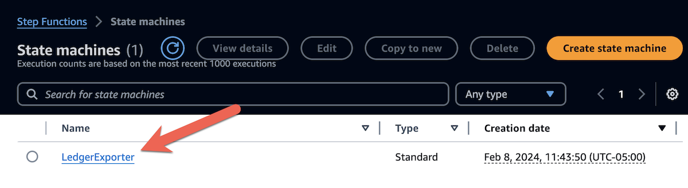

Click the **Start Execution** button.  The step function accepts a JSON object as input.  Paste the snippet of JSON below into the JSON editor.  If you increased the concurrent export limit through AWS Support, you may change the value of `ExportCount` to the new limit.

```json
{
  "LedgerName": "vehicle-registration",
  "BucketPrefix": "dmv/",
  "ExportCount": 2
}
```
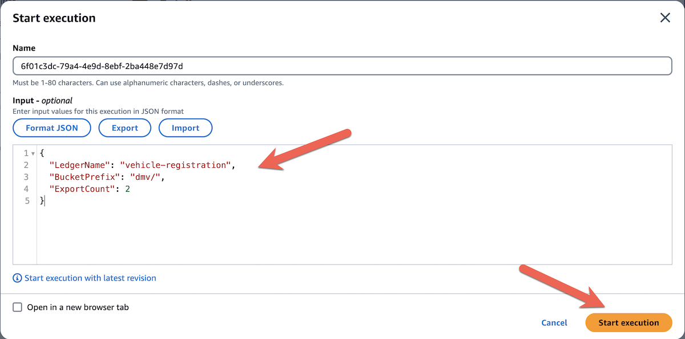

Click **Start Execution**.  The step function will run for about 10 minutes for the vehicle-registration ledger, but will run longer for bigger ledgers.  Upon completion, the **Execution status** of the execution will be “Succeeded”.  The **Graph view** section of the execution page shows a graphic depiction of the steps in the state machine.  Click on the “Export” node, copy the export IDs from the **Output** section, and paste them into a text editor.  You’ll need them in subsequent steps.

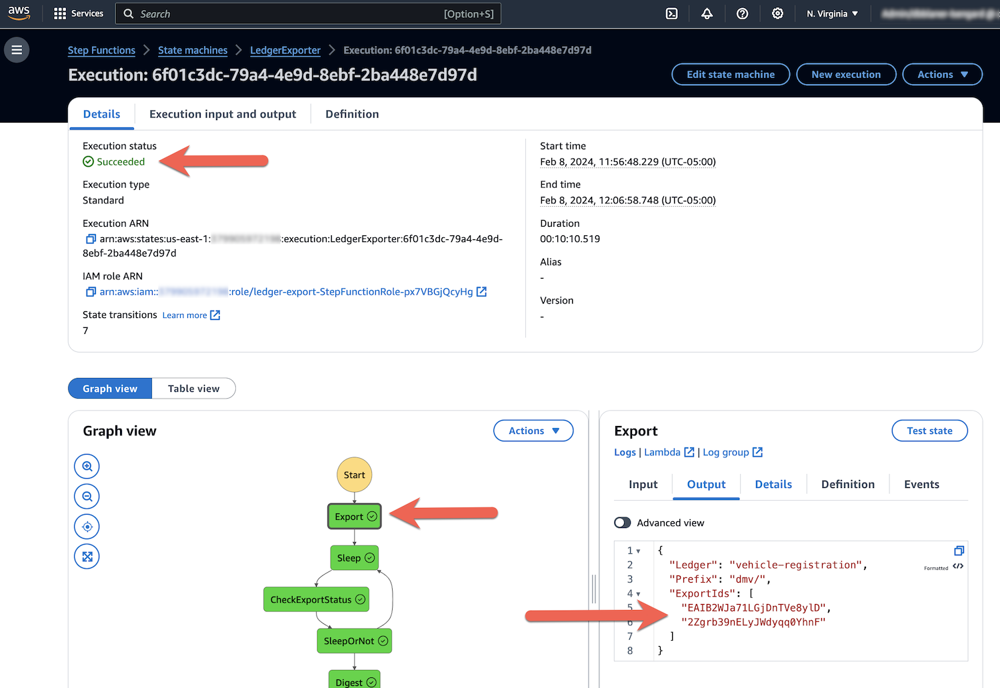

Next, click on the “Digest” node.  Copy the values of “LastBlockNum” and “LastBlockTimestamp” into a text editor for later.

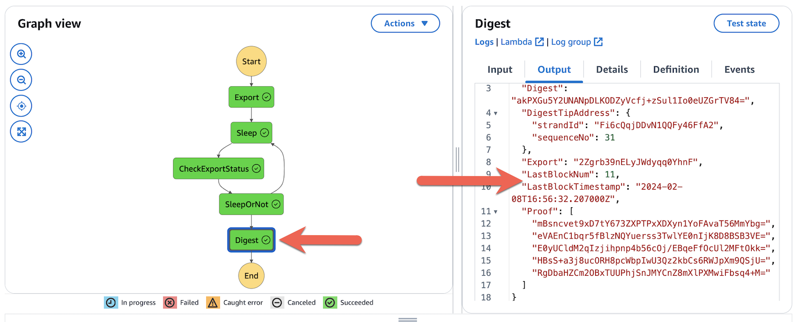

The export is complete.  The process created an S3 bucket called “ledger-export-*[ACCOUNT ID]*” with a folder called “dmv” that contains the exported ledger data in JSON format.  The name of the folder was set in the `BucketPrefix` parameter in the input to the step function execution.

### Extract and Transform Data

With the ledger export completed, the next step is to extract the ledger data from the exported JSON files and transform it into CSV files for efficient loading into Aurora PostgreSQL.  The solution creates an AWS Glue job to perform the extraction and transformation.  Glue uses Apache Spark to distribute the export data set across multiple compute nodes for concurrent processing, reducing the time required to process the data from large ledgers.  The Glue job reads the exported data from the S3 bucket created in the export step and writes its output into a new ETL bucket created by the process.  

The Glue job is built to convert the tables from the vehicle-registration ledger into the schema we’ve designed for the target database, flattening the structure of ledger documents into the rows and columns of a relational database.  To use this process to migrate your ledger, you’ll need to modify portions of the Glue job’s PySpark code to accommodate your data model.

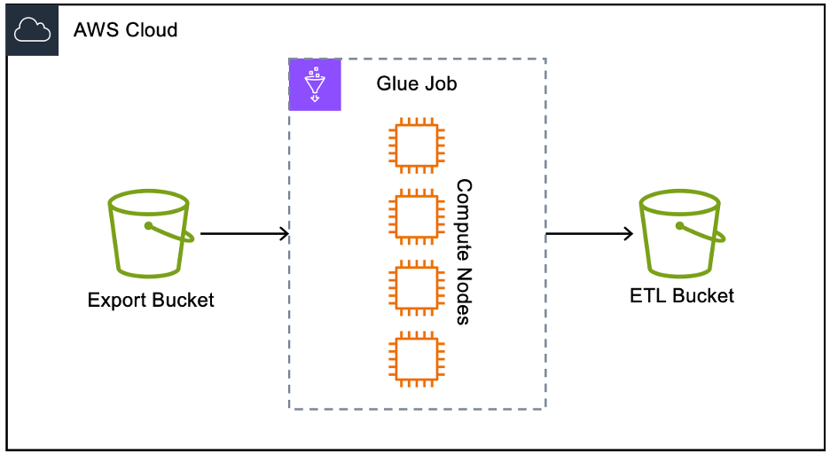

Create a new CloudFormation stack called "ledger-full-migrate" using the ledger-full-migration.yml file from the project files.  The template has several parameters.  Set values for the parameters using following table for guidance.

|Parameter|Value|
|---|---|
|**LedgerName**|The value of the **LedgerName** output parameter from the **ledger-migrate-setup** stack.|
|**ExportIds**|The export IDs copied from the step function execution, formatted as a comma-delimited list.|
|**ExportBasePrefix**|dmv/|
|**GlueWorkerType**|G.2X|
|**NumberOfGlueWorkers**|2|
|**ReplicationInstanceSubnets**|Select the subnets from the DatabaseSubnets parameter from the ledger-migrate-setup stack.|
|**ReplicationInstanceClass**|dms.r6i.large|
|**SecurityGroups**|Select security groups from the **DatabaseSecurityGroups** parameter from the **ledger-migrate-setup** stack.|
|**TargetDatabaseSecretName**|The value of the **MigrateDatabaseUserSecretName** output parameter from the **ledger-migrate-setup** stack.|
|**TargetDatabaseName**|The value of the **TargetDatabaseName** output parameter from the **ledger-migrate-setup** stack.|

Launch the stack. When it completes, navigate to the AWS Glue console.  Click **ETL jobs** in the left-hand navigation.

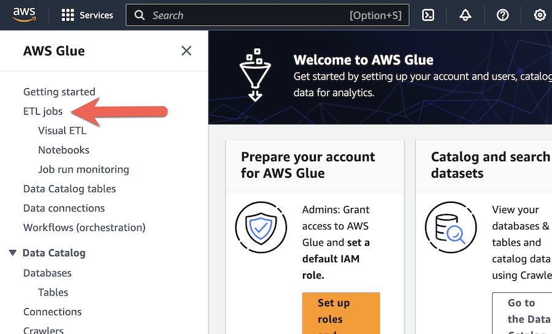

Select the “ledger-dmv-migrate” job and click **Run job**.

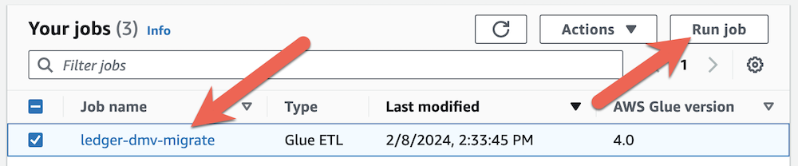

Click the name of the job to open the job details page.  Click on the **Runs** tab to view the status of the job execution.  When the job is complete, its status will be “Succeeded”.

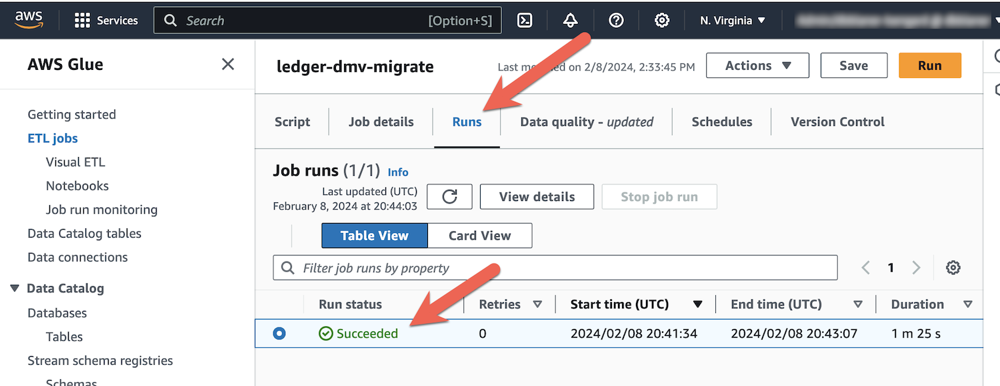

The CloudFormation template created an S3 bucket called “ledger-etl-*[ACCOUNT ID]*”.  The Glue job writes its output to a folder called “dmv” in that bucket.  Navigate to the Amazon S3 console and click on the “ledger-etl-*[ACCOUNT ID]*” bucket.  Click on the “dmv” folder.  You’ll see a list of folders, one for each of the tables in the vehicle-registration ledger.  These folders contain the latest revision of every non-deleted document in the table.  There will be an additional folder for each ledger table containing the contents of the audit table that will be written to the target Aurora PostgreSQL database.  The audit tables contain the complete revision history of all documents in their respective ledger table.

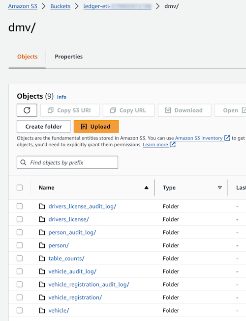

Feel free to click through the folders and explore their contents.  Note that there’s a folder called “table_counts”.  In this folder is a single file containing the name of each table from the ledger with the respective number of document revisions in the table.  This can be useful for verifying that all records were migrated into the target database.

### Full Data Migration

The full migration uses AWS Database Migration Service (DMS) to read the CSV output of the Glue job in the previous step and load it into Aurora PostgreSQL.  DMS truncates tables in the target database before loading data.  Note that while we have chosen Aurora PostgreSQL as our target database, DMS can migrate the Glue job output to [many other databases](https://docs.aws.amazon.com/dms/latest/userguide/CHAP_Target.html).

Navigate to the DMS console and click **Database migration tasks** in the left-hand navigation.  Select the “dmv-full-migration” task, click the **Actions** drop-down, and click **Restart/Resume**.

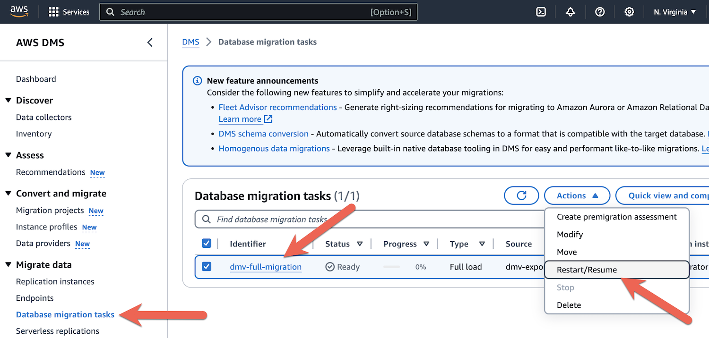

Click the **Restart/Resume** button in the Possible data loss on target database alert.  The migration task will begin running.  Its **Status** will reflect the progress of the job.  When the job completes, its status will be “Load complete”.  At that point, all of the data exported from the vehicle-registration ledger in QLDB will be migrated to the Aurora PostgreSQL database.

Next, create indexes and constraints in the Aurora PostgreSQL database.  Navigate to the RDS console and connect to the “ledger” database just as we did in earlier sections.  Copy all of the lines from the “dmv-postload-ddl.sql” file from the GitHub project, paste them into the RDS query editor, and click **Run** to execute them.

Using the RDS query editor, run some of the queries below to explore the migrated data.

```sql
select * from dmv.person; 
select * from dmv.person_audit_log;
select * from dmv.vehicle;
select * from dmv.vehicle_audit_log;
select * from dmv.vehicle_registration;
select * from dmv.vehicle_registration_audit_log;
select * from dmv.drivers_license;
select * from dmv.drivers_license_audit_log;
```
Notice that the `ql_audit` column in each table is a PostgreSQL JSONB type.  This column contains revision metadata from the QLDB ledger.  Run the query below to see how to access individual fields in the JSON object.

```sql
select person_id, ql_audit->'ql_txid' transaction_id, ql_audit->'ql_txtime' transaction_timestamp from dmv.person_audit_log;
```

### On-Going Change Data Replication

The full migration process migrates all data exported from the ledger.  However, the ledger may continue to be used after the export until applications that use the ledger are modified to use the Aurora PostgreSQL database.  The next step of the migration is to capture ongoing changes as they happen and replicate them to the Aurora PostgreSQL database in near real-time.  The solution uses QLDB’s [streaming](https://docs.aws.amazon.com/qldb/latest/developerguide/streams.html) feature that sends ledger changes into an Amazon Kinesis Data Stream in near real-time.  A Lambda function consumes ledger events from the data stream and writes them to the Aurora PostgreSQL database using the [RDS Data API](https://docs.aws.amazon.com/AmazonRDS/latest/AuroraUserGuide/data-api.html).


Deploy the required components for change data replication using AWS CloudFormation.  Create a new CloudFormation stack called "ledger-cdc-migrate" using the ledger-cdc-migration.yml file from the project files.  The template has several parameters.  Set values for the parameters using following table for guidance.

|Parameter|Value|
|---|---|
|**AuroraClusterArn**|The value of the **AuroraClusterArn** output parameter from the **ledger-migrate-setup** stack.|
|**AuroraDatabaseName**|The value of the **TargetDatabaseName** output parameter from the **ledger-migrate-setup** stack.|
|**DatabaseUserSecretArn**|The value of the **MigrateDatabaseUserSecretName** output parameter from the **ledger-migrate-setup** stack.|
|**KinesisShardCount**|1|
|**LastFullLoadBlock**|Enter the value of “LastBlockNum” taken from the export step function.|
|**LedgerName**|The value of the **LedgerName** output parameter from the **ledger-migrate-setup** stack.|
|**LedgerStreamStartTime**|Enter the value of “LastBlockTimestamp” taken from the export step function.|

Launch the stack. When the stack deployment completes, on-going replication is active.  To see replication in action, navigate to the PartiQL editor in the QLDB console.  Select the “vehicle-registration” ledger in the **Choose a ledger drop-down** and enter the following query.

```sql
update Person set FirstName = 'Melvin' where GovId = 'P626-168-229-765';
```

Navigate over to the RDS query editor and execute the following query against the target database.

```sql
select * from dmv.person_audit_log where gov_id = 'P626-168-229-765'
```

Note that the audit table contains two records for Melvin Parker.  The original version contains the first name spelled “MelVIN”, has a `version` of 0 and an `operation` of “I” for INSERT.  The updated version has the corrected first name “Melvin”, a `version` of 1 and an `operation` of “U” for UPDATE.  Now run the following query.

```sql
select * from dmv.person where gov_id = 'P626-168-229-765'
```

The live table contains the latest revision of Melvin Parker’s record.  Note the first name and the `version` number.

### Clean-Up

To delete the AWS infrastructure created in this project, navigate to the CloudFormation console and delete the following stacks in order:  ledger-cdc-migrate, ledger-full-migrate, ledger-export, and setup.yml.

The stacks leave behind two S3 buckets: ledger-export-*[ACCOUNT ID]* and ledger-etl-*[ACCOUNT ID]*.  This is to prevent accidental deletion of critical QLDB ledger data if the solution is adapted to migrate a production ledger.  For the vehicle-registration migration, delete the contents of each bucket, then delete the buckets themselves.

## Adapting the Solution for Your Ledger

This migration solution can be adapted for use with your ledger.  You’ll need to modify the schema definition in the `PrepareTargetDatabase` resource in the setup.yml template file in the project to create your custom schema.  You’ll also need to modify the “dmv-postload-ddl.sql” file to create primary and secondary indexes for your custom schema.

In the “ledger-dmv-migrate” Glue job’s PySpark code, lines 141-146 define conversion functions and output columns for the tables in the source ledger in a Python dict called `table_converters`.  The conversion functions flatten a single document revision from the ledger into columns that can be output as CSV.  Modify the definition of `table_converters` and the related conversion functions for the data models of the source and target databases.  The source code for the Glue job is defined in the `PutGlueJobCodeToS3` resource in the “ledger-full-migration.yml” file in the GitHub project.

```python
table_converters = {
    'Person': {
        'name': 'person',
        'func': convert_person,
        'columns': ['doc_id', 'version', 'person_id', 'first_name', 'last_name', 'dob', 'gov_id', 'gov_id_type',
                    'address', 'ql_audit']

    },
    'Vehicle': {
        'name': 'vehicle',
        'func': convert_vehicle,
        'columns': ['doc_id', 'version', 'vin', 'type', 'year', 'make', 'model', 'color', 'ql_audit']
    },
    'VehicleRegistration': {
        'name': 'vehicle_registration',
        'func': convert_vehicle_registration,
        'columns': ['doc_id', 'version', 'vin', 'license_plate_num', 'state', 'city', 'pending_penalty_amt',
                    'valid_from_dt', 'valid_to_dt', 'primary_owner', 'secondary_owners', 'ql_audit']
    },
    'DriversLicense': {
        'name': 'drivers_license',
        'func': convert_drivers_license,
        'columns': ['doc_id', 'version', 'person_id', 'license_plate_num', 'license_type', 'valid_from_dt',
                    'valid_to_dt', 'ql_audit']
    }
}
```

The Lambda function that consumes ledger updates from the Kinesis data stream contains identical logic that must also be modified.  The code to modify is defined in the `StreamConsumerFunction` resource in the “ledger-cdc-migration.yml” template file in the project. 

Finally, the `SourceEndpoint` resource in the “ledger-full-migration.yml” file defines a DMS source endpoint that defines the structure of the CSV files produced by the Glue job.  This definition must be modified to match the new structure.  See [here](https://docs.aws.amazon.com/dms/latest/userguide/CHAP_Source.S3.html#CHAP_Source.S3.ExternalTableDef) for more information on the DMS table definition format.

Before performing the migration, backup the target database.  The migration solution truncates tables in the target database and does not roll back the entire migration for errors.

## License

This library is licensed under the MIT-0 license.

